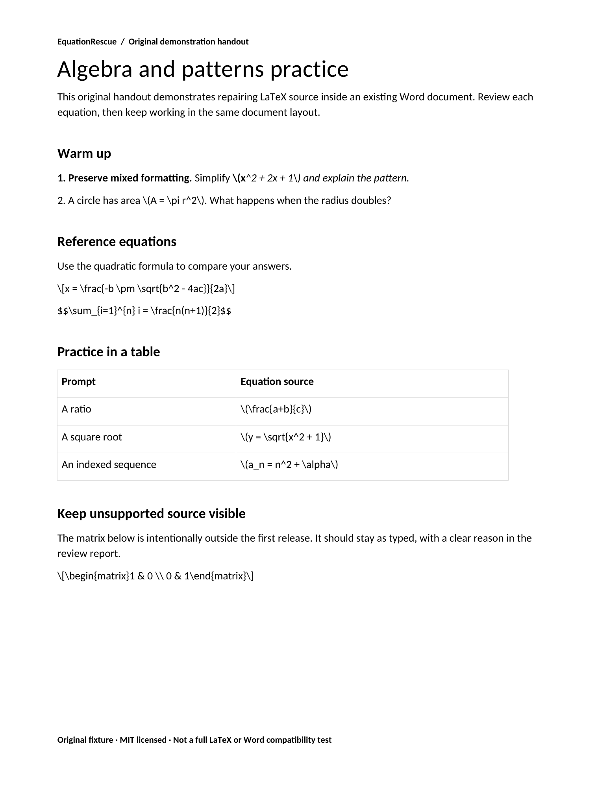
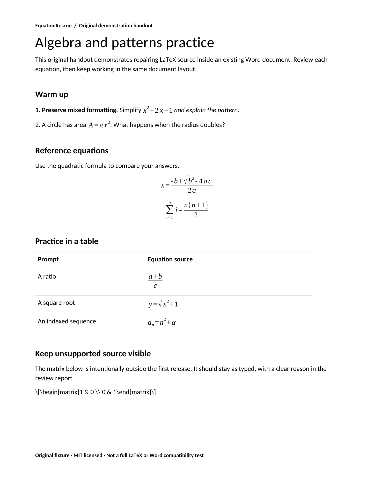

# EquationRescue

**Repair explicit LaTeX inside an existing DOCX, locally in your browser.**

Open a file, review each candidate, choose what to convert, and download a new copy containing native Word equation markup. Unsupported source stays visible. No account, upload endpoint, analytics, API key, or model call.

**Experimental v0.1.** A small, conservative repair tool for teaching handouts and simple notes. It is not a universal LaTeX converter. Always keep the original and open the output in Word to check both layout and editability.

[中文说明](README.zh-CN.md) · [Supported syntax](docs/supported-syntax.md) · [Validation](docs/validation.md) · [Security](SECURITY.md)

## See the actual result

The bundled original handout has eight candidates: seven supported equations, including one split across bold and italic runs, and one deliberately unsupported matrix. The matrix remains source text. These are **LibreOffice renderings of the actual DOCX files**, not a screenshot of Microsoft Word and not a guarantee of Word compatibility.

<p>
  
  
</p>

[Original DOCX](public/examples/teaching-handout.docx) · [Repaired DOCX](public/examples/teaching-handout.repaired.docx) · [Conversion report](public/examples/teaching-handout.report.json)

## Run it

Node 22.12+ or Node 24:

```sh
npm ci
npm run dev
```

Open the local address printed by Vite. Choose **Try the teaching handout** or select your own `.docx`. Review the source and approximate math previews, skip anything you want to keep, and download the repaired copy. The separate JSON report contains the filename and equation source, so treat it like part of the original document.

To build a static deployment:

```sh
npm run check
npm run build
npm run preview
```

The `dist/` folder needs only a static file server. No backend is included. All libraries and fonts are bundled. Loading the page and example fetches assets from the same host; file processing does not transmit document content. Once the page is loaded, an uploaded document can be processed without network access. This is not an installable offline/PWA package.

## What the first release does

- Finds explicit `\(...\)`, `\[...\]` and `$$...$$` delimiters in ordinary body paragraphs and table cells
- Joins text split across simple Word runs while retaining surrounding run formatting
- Converts a tested subset: fractions, square roots, sub/superscripts, Greek letters, basic operators, sums and products
- Lets you convert or skip each supported candidate; unsupported candidates retain source and get a reason
- Keeps every other ZIP member's local header and compressed bytes exactly unchanged; changes only the main document XML and ZIP directory offsets
- Re-parses output XML and checks untouched-member preservation before download
- Returns a byte-identical copy if nothing is selected
- Provides English and Chinese UI

Equations can change line heights and pagination. Preserving text/style/package data does not mean pixel-identical layout. Math typography comes from native equation formatting, not the source run's bold/italic appearance.

## Deliberate limits

Display delimiters must occupy their own paragraph. Single `$...$` is ignored to avoid interpreting prices as math. Delimiters cannot span paragraphs. Matrices, arbitrary LaTeX commands/macros, text commands, stretchy `\left`/`\right`, indexed roots, and packages are unsupported.

Paragraphs containing existing OMML, bookmarks, fields, hyperlinks, objects, comments, or unfamiliar XML structures are left unchanged. Headers, footers, notes and text boxes are not repaired. Hidden-text, tracked-change, track-enabled, protected, signed, macro-enabled, encrypted, scanned, legacy DOC, ZIP64 and strict-OOXML documents are rejected or out of scope.

Safety limits: 20 MiB input, 2,048 ZIP entries, 64 MiB declared expanded total, 16 MiB per member, 8 MiB inspected XML, 500 equation candidates, 2,000 characters per formula, 32 nested math groups. The ZIP reader validates headers, paths, CRC for read members and expansion while inflating; it does not extract files to disk. This does not make arbitrary DOCX files safe to open. Embedded files and external relationships are preserved, not scanned or followed.

## Verification

```sh
npm test                  # core + hostile-input regressions
npm run build             # TypeScript and production bundle
npx playwright install chromium
npm run test:e2e           # upload/review/export/browser privacy checks
npm run samples           # regenerate after DOCX/report from checked-in before
```

The GitHub Actions workflow runs unit tests, the production build and Chromium tests. A configured workflow is not a passing CI run. The current verification record distinguishes actual passes from unrun checks in [docs/validation.md](docs/validation.md).

The source fixture can be recreated with `python scripts/generate-sample.py` using `python-docx`. The resulting DOCX should be rendered and visually checked whenever the fixture is changed.

## Architecture

- `src/core/zip.ts`: bounded ZIP reader and a one-member writer; untouched compressed records are copied
- `src/core/xml.ts`: namespace-aware SAX parsing with source offsets; rejects DTDs/entities
- `src/core/math.ts`: intentionally small LaTeX parser emitting native OMML, refusing unknown constructs
- `src/core/docx.ts`: candidate mapping, conservative eligibility checks, selected run patches and report
- `src/main.ts`: local review UI; KaTeX is a preview only and is not the export engine

The core has no DOM dependency, so the same fixtures can be tested in Node. The application never regenerates an entire Word document through a document-generation library.

## Prior art and provenance

This project does **not** claim to invent LaTeX-to-OMML conversion or DOCX repair. [AfterMath](https://github.com/axobase001/aftermath) already offers an MIT-licensed Python CLI for this underlying workflow. [Converter](https://github.com/SniperRavan/Converter) addresses a broader paste-to-document workflow. EquationRescue's experiment is a browser-local, selective review-and-repair interface for an existing file.

We assessed [seewo-doc/docx-math-converter](https://github.com/seewo-doc/docx-math-converter), including its npm metadata. Its repository license and package license fields differ (MIT/ISC), and its MathJax/jsdom/docx-fork path is broader than this narrow patching tool needs. We do not depend on or copy its conversion code. The deliberately small parser here is original project code with an explicit refusal list.

[Third-party notices](THIRD_PARTY_NOTICES.md) cover bundled fflate, saxes, xmlchars and KaTeX. The handout and screenshots are original project fixtures. The application and documentation were developed with AI assistance; correctness comes from reproducible checks and honest limits, not authorship claims.

## Contribute

Start with [CONTRIBUTING.md](CONTRIBUTING.md). The most useful contribution is a minimal, non-sensitive DOCX fixture demonstrating a missed or incorrect case, including the Word version and expected result. Never upload a private student, client, or research document to an issue.

MIT licensed. No affiliation with Microsoft, OpenAI, AfterMath or the projects named above.
